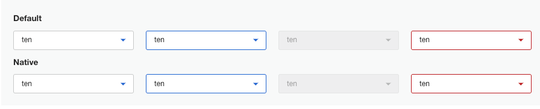
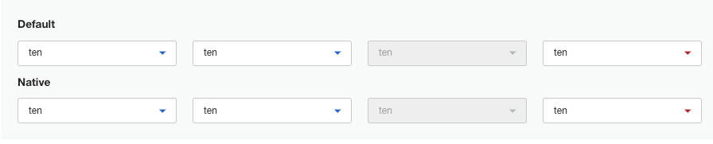

# Storybook MUI custom classname generation issue

- 📄 Discussion: <https://github.com/storybookjs/storybook/discussions/24350>

This repository exists to demonstrate an issue when using [MUIs ClassName generator customisation](https://mui.com/material-ui/experimental-api/classname-generator/) with storybook.

## Issue

When viewing storybook stories via statically generated builds, the import order within `preview.tsx` is not respected, which in the case of MUI classname customisation causes styling and clasname operations to happen out of order resulting in mixed styles.

The storybook static builds work correctly if the import that customises the Mui ClassName generation is disabled:

`preview.tsx`

```tsx
import "./MuiClassNameSetup"; // Comment this line out to 'fix' storybook static builds
```

### Expected

Here we can see the expected styles being applied correctly, which can be seen when running storybook via `npm run storybook`



### Actual

This is the rendered content looks like when serving the statically generated builds which can be seen via `npm run storybook:static`


